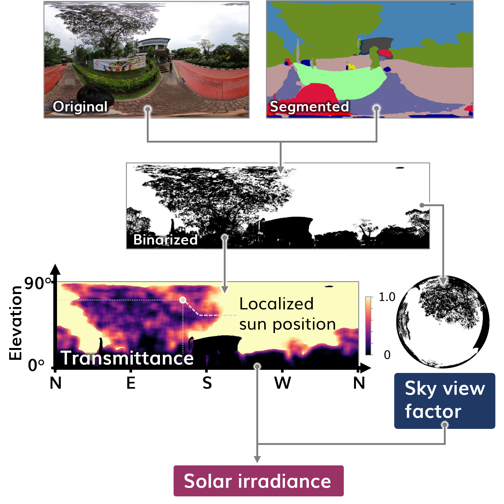

<!--  -->
<p align="center">
  
</p>


[](https://pypi.python.org/pypi/tree-shade-mapper)
[](https://colab.research.google.com/drive/1fUcqN6aSLGZnzzahIZiy_AkigFn5gY2e?usp=sharing)
[](https://pypi.org/project/tree-shade-mapper/)
[](https://pepy.tech/project/tree-shade-mapper)
<!-- [](https://creativecommons.org/licenses/by-sa/4.0/) -->

## Overview
Repository for the script used for estimating and mapping the shading effect of trees considering transmittance of tree Canopies from panoramic imagery, developed by the [Urban Analytics Lab (UAL)](https://ual.sg/) at the National University of Singapore (NUS) in collaboration with [Takenaka Corporation](https://www.takenaka.co.jp/takenaka_e/).

You can read more about this project on [its website](https://ual.sg/publication/***/) too.

The journal paper can be found [here](https://doi.org/***). 

The method integrates semantic segmentation and binariation to calculate transmittace of tree canopies and estimates the sky view factor and solar irradiance using the calculated transmittance.

<p align="center">
  
</p>

The potential use cases include high-resolution mapping of the sky view factor and solar irradiance and walk route evaluation considering sunlight exposure.

<p align="center">
  
</p>

## Installation of `tree_shade_mapper`

```bash
$ pip install tree_shade_mapper
```
## Installation of `pytorch` and `torchvision`

Since `tree_shade_mapper` uses `pytorch` and `torchvision`, you may need to install them separately. Please refer to the [official website](https://pytorch.org/get-started/locally/) for installation instructions.

## Usage

### Data preparation
You need to create a dataset with panoramic imagery and a csv file. Please refer to the sample files in the "data" directory. 

### Calculation and mapping
```python
from tree_shade_mapper import get_tree_shade

base_dir = '/path/to/your/input/data'
calc_type = 'map'

# Define start and end time, and the interval
time_start = '2024-01-01 07:00:00'
time_end = '2024-01-01 20:00:00'
interval = '60min'

# Define time zone and location
time_zone = 'Asia/Singapore'
latitude = 1.29751
longitude = 103.77012

vmin = 0
vmax = 1200
resolution = 14

#Image size (You need to adjust here checking the results)
image_size = (512, 256)

get_tree_shade(
    base_dir,
    time_start,
    time_end,
    interval,
    time_zone,
    latitude,
    longitude,
    image_size=image_size,
    calc_type=calc_type,
    vmin=vmin,
    vmax=vmax,
    resolution = resolution
)
```

## License

`tree_shade_mapper` was created by Kunihiko Fujiwara. It is licensed under the terms of the CC BY-SA 4.0.

## Citation

Please cite the [paper](https://doi.org/10.1016/j.buildenv.2024.112071) if you use `tree_shade_mapper` in a scientific publication:

Fujiwara, K., Ito, K., Ignatius, M., & Biljecki, F. (2024). A panorama-based technique to estimate sky view factor and solar irradiance considering transmittance of tree canopies. Building and Environment, 266, 112071.

```bibtex
@article{2024_bae_svf,
  author = {Fujiwara, Kunihiko and Ito, Koichi and Ignatius, Marcel and Biljecki, Filip},
  doi = {10.1016/j.buildenv.2024.112071},
  journal = {Building and Environment},
  pages = {112071},
  title = {A panorama-based technique to estimate sky view factor and solar irradiance considering transmittance of tree canopies},
  volume = {266},
  year = {2024}
}
```

<!-- XXX

```bibtex
@article{2024_XXX,
 author = {XXX, XXX},
 doi = {XXX},
 journal = {XXX},
 pages = {XXX},
 title = {XXX},
 volume = {XXX},
 year = {XXX}
}
``` -->

## Credit

This package uses [ZenSVI](https://github.com/koito19960406/ZenSVI) for semantic segmentation.

This package was created with [Cookiecutter](https://github.com/audreyr/cookiecutter) and the [`audreyr/cookiecutter-pypackage`](https://github.com/audreyr/cookiecutter-pypackage) project template.

--------------------------------------------------------------------------------
<br>
<br>
<p align="center">
  <a href="https://ual.sg/">
    
  </a>
</p>
